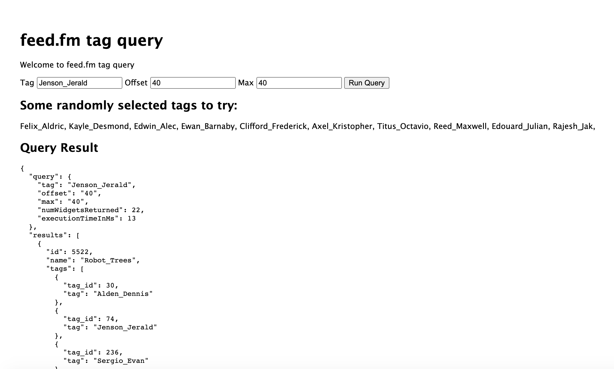

# feed.fm Query

## About

This is a Node/Express application that uses the Knex Query Builder.

It implements the findWidgetsWithTag() function to query a MySQL database.  See file:  utils/query.js

It includes Knex migrations to create the db tables, and seeds to populate the data.

For populating data it uses http://names.drycodes.com/ to get some random names/strings.

## Assumptions

I seeded the database as follows:
- 10,000 Widgets
- 10,000 Dongles
- 1,000 Tags
- I randomly associated between 1 and 10 tags to each widget.
- I randomly associated between 10 and 20 dongles to each widget.

These numbers could easily be adjusted in the seed files.

## If you'd like to actually try this out:

- install knex cli globally:  npm instal -g knex

- Create a .env file in top level dir with the following contents:

```Bash
APP_NAME=feedfmQuery
APP_ENV=local

DB_HOST=db
DB_PORT=3306
DB_DATABASE=feedfm
DB_USERNAME=feedfm
DB_PASSWORD=C00lVoyage!
```

Run the following:

- npm install
- docker-compose up -d
- (wait a minute for MySQL to come up)
- Try out http://localhost:8080 for phpmyadmin username: feedfm, password: C00lVoyage!
- npm run seed (this creates the db tables and seeds them with data)
- npm run
- Go to http://localhost:3000

You should see a simple UI that lets you run a query, something like this:
(The strange strings are generated by [drycodes](http://names.drycodes.com/))



